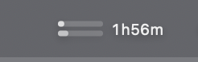
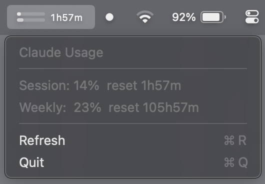

# Claude Usage Bar

A tiny macOS menu bar app that shows your Claude (claude.ai) usage in real time.





- **Top bar** — Session (5-hour window) utilization %
- **Bottom bar** — Weekly (7-day) utilization %
- **Countdown** — Time until session reset

Data comes directly from Anthropic's API using your Claude Code OAuth token (stored in macOS Keychain).

## Requirements

- macOS 13+
- [Claude Code](https://docs.anthropic.com/en/docs/claude-code) installed and logged in (this stores the OAuth token the app reads)

## Build & Run

```bash
chmod +x build.sh
./build.sh
open build/ClaudeUsageBar.app
```

On first launch, macOS will ask for Keychain access to "Claude Code-credentials" — click **Always Allow**.

## Install

```bash
cp -r build/ClaudeUsageBar.app /Applications/
```

To auto-start on login: System Settings > General > Login Items > add ClaudeUsageBar.

## How It Works

1. Reads OAuth token from macOS Keychain (`Claude Code-credentials`)
2. Calls `GET https://api.anthropic.com/api/oauth/usage` with Bearer auth
3. Parses `five_hour` (session) and `seven_day` (weekly) utilization percentages
4. Renders two thin bars + countdown timer in the menu bar
5. Refreshes every 60 seconds

## Tech

Single-file Swift app (~300 lines), no dependencies, no Xcode required. Just `swiftc`.

## License

MIT
